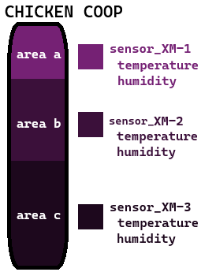

# Lab: Go with InfluxDB
Using DB Temporal InfluxDB with GO.

## Story
Somewhere in the world there is a farm. The founder's grandson adopted technology as an ally after a series of failures in managing the farm. Several sensors were installed in the main areas and collect information in real time. This information is sent to a remote server and made available for real-time analysis.

## FARM X: OVERVIEW


## FARM X: CHICK COOP


locations:
- area a
  - sensor_XM-1
- area b
  - sensor_XM-2
- area c
  - sensor_XM-3
- metrics
  - temperature
  - humidity

## FARM X: BEAM


locations:
- quadrant_A1
  - sensor_XM1
- quadrant_A2
  - sensor_XM2
- quadrant_B1
  - sensor_XM3
- quadrant_B2
  - sensor_XM4
- metrics
  - temperature
  - humidity

## FARM X: LETTUCE


locations:
- front
  - sensor_XMX
- back
  - sensor_XMX
- metrics
  - temperature
  - ph

## FARM X: CPD


locations:
- server room
  - sensor_XM0
- metrics
  - temperature

## FARM X: SERVER X


locations:
- server x
  - os
- metrics
  - CPU %
  - RAM %

## Using Influx
- Run de docker-compose: `docker-compose up -d`
- Access: `http://localhost:8086`
- Create **User**, **pass**, **org** and **bucket** (see file `./config/config.go`)
- Save **token access**, change value `./config/config.go`.

## Options: `./config/config.go`
- `VerboseMode`: Display entity in log.
- `RunTime`: Total data sending time (seconds).
- `DelayCPD`: Delay time (seconds) in sending CPD data.
- `DelayBean`: Delay time (seconds) in sending Bean data.
- `DelayLettuce`: Delay time (seconds) in sending Lettuce data.
- `DelayChickenCoop`: Delay time (seconds) in sending Chicken Coop data.
- `DelayServerX`: Delay time (seconds) in sending Servidor X data.

## log -- VerboseMode true
```
[START] Target run time: 30 second(s).
[START][CYCLE] Total: 26.
[START][CYCLE] Bean: 10.
[START][CYCLE] Lettuce: 6.
[START][CYCLE] Chicken Coop: 6.
[START][CYCLE] CPD: 1.
[START][CYCLE] Server X: 3.
[2025-03-30T19:58:58-03:00][DEBUG][1] Bean: {Bean [{type humidity} {location quadrant_A1} {device sensor_XM1}] 89.625565}
[2025-03-30T19:59:00-03:00][DEBUG][1] Chicken Coop: {Chicken Coop [{type humidity} {location area c} {device sensor_XM-3}] 55.156857}
[2025-03-30T19:59:00-03:00][DEBUG][1] Lettuce: {Lettuce [{type temperature} {location back} {device sensor_XMX}] 28.115952}
[2025-03-30T19:59:01-03:00][DEBUG][2] Bean: {Bean [{type humidity} {location quadrant_A2} {device sensor_XM2}] 39.883408}
[2025-03-30T19:59:04-03:00][DEBUG][3] Bean: {Bean [{type temperature} {location quadrant_B1} {device sensor_XM3}] 28.319279}
[2025-03-30T19:59:05-03:00][DEBUG][1] Server X: {Server X [{type RAM %} {location server x} {device os}] 61.023212}
[2025-03-30T19:59:05-03:00][DEBUG][2] Lettuce: {Lettuce [{type ph} {location back} {device sensor_XMX}] 6.8993454}
[2025-03-30T19:59:05-03:00][DEBUG][2] Chicken Coop: {Chicken Coop [{type temperature} {location area b} {device sensor_XM-2}] 21.763004}
[2025-03-30T19:59:07-03:00][DEBUG][4] Bean: {Bean [{type temperature} {location quadrant_A1} {device sensor_XM1}] 26.230732}
[2025-03-30T19:59:07-03:00][DEBUG][3] Lettuce: {Lettuce [{type temperature} {location front} {device sensor_XMX}] 36.363907}
[2025-03-30T19:59:07-03:00][DEBUG][3] Chicken Coop: {Chicken Coop [{type humidity} {location area a} {device sensor_XM-1}] 64.97464}
[2025-03-30T19:59:08-03:00][DEBUG][5] Bean: {Bean [{type temperature} {location quadrant_A2} {device sensor_XM2}] 20.101513}
[2025-03-30T19:59:11-03:00][DEBUG][6] Bean: {Bean [{type humidity} {location quadrant_A1} {device sensor_XM1}] 22.635555}
[2025-03-30T19:59:12-03:00][DEBUG][2] Server X: {Server X [{type RAM %} {location server x} {device os}] 29.096218}
[2025-03-30T19:59:13-03:00][DEBUG][4] Lettuce: {Lettuce [{type temperature} {location back} {device sensor_XMX}] 18.807518}
[2025-03-30T19:59:13-03:00][DEBUG][4] Chicken Coop: {Chicken Coop [{type temperature} {location area c} {device sensor_XM-3}] 42.907654}
[2025-03-30T19:59:14-03:00][DEBUG][7] Bean: {Bean [{type temperature} {location quadrant_A2} {device sensor_XM2}] 29.555946}
[2025-03-30T19:59:17-03:00][DEBUG][1] CPD: {CPD [{type temperature} {location server room} {device sensor_XM0}] 36.217014}
[2025-03-30T19:59:17-03:00][DEBUG][END] CPD
[2025-03-30T19:59:17-03:00][DEBUG][8] Bean: {Bean [{type humidity} {location quadrant_B2} {device sensor_XM4}] 23.196835}
[2025-03-30T19:59:18-03:00][DEBUG][5] Lettuce: {Lettuce [{type temperature} {location front} {device sensor_XMX}] 43.41252}
[2025-03-30T19:59:18-03:00][DEBUG][5] Chicken Coop: {Chicken Coop [{type temperature} {location area c} {device sensor_XM-3}] 36.28431}
[2025-03-30T19:59:20-03:00][DEBUG][9] Bean: {Bean [{type temperature} {location quadrant_A2} {device sensor_XM2}] 36.7585}
[2025-03-30T19:59:22-03:00][DEBUG][3] Server X: {Server X [{type CPU %} {location server x} {device os}] 20.259832}
[2025-03-30T19:59:22-03:00][DEBUG][END] Server X
[2025-03-30T19:59:23-03:00][DEBUG][6] Lettuce: {Lettuce [{type temperature} {location back} {device sensor_XMX}] 36.540054}
[2025-03-30T19:59:23-03:00][DEBUG][END] Lettuce
[2025-03-30T19:59:23-03:00][DEBUG][6] Chicken Coop: {Chicken Coop [{type temperature} {location area b} {device sensor_XM-2}] 32.93239}
[2025-03-30T19:59:23-03:00][DEBUG][END] Chicken Coop
[2025-03-30T19:59:24-03:00][DEBUG][10] Bean: {Bean [{type temperature} {location quadrant_A1} {device sensor_XM1}] 21.238789}
[2025-03-30T19:59:24-03:00][DEBUG][END] Bean
[END] Time total: 31.614645 seconds.
```

## log -- VerboseMode false
```
[START] Target run time: 30 second(s).
[START][CYCLE] Total: 26.
[START][CYCLE] Bean: 10.
[START][CYCLE] Lettuce: 6.
[START][CYCLE] Chicken Coop: 6.
[START][CYCLE] CPD: 1.
[START][CYCLE] Server X: 3.
..........................
[END] Time total: 31.032793 seconds.
```

## InfluxDb

